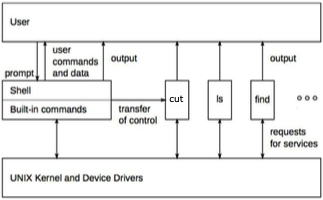

# CS4218 Project: Shell Application

## Table of Contents
  * [Overview](#overview)
  * [Technologies used](#technologies-used)
  * [Instructions to setup project](#instructions-to-setup-project)
  * [Instructions to run the Shell program](#instructions-to-run-the-shell-program)
  * [Instructions to run all our test cases](#instructions-to-run-all-our-test-cases)
  * [External libraries / plugins / tools / technologies used](#external-libraries-/-plugins-/-tools-/-technologies-used)
  * [Acknowledges / References](#acknowledges-/-references)

## Overview

A shell is a command interpreter. Its responsibility is to interpret commands that the user types and to run programs that the user specifies in her command lines.
Figure 1 shows the relationship between the shell, the kernel, and various applications/utilities in a UNIX- like operating system:

Figure 1: relationship between the shell, the kernel, and various applications

Shell can be thought of as a programming language for running applications. From the user’s perspective, it will performs the following loop continuously as below:
1. Print prompt message.
2. Wait for user’s command.
3. Parse and interpret user’s command, run specified applications if any.
4. Print output.
5. Go to 2.

The goal of the project is to implement and test a shell and a set of applications. The shell and the applications must be implemented in JAVA programming language. The required functionality is a subset (or simplification) of the functionality provided by UNIX-like systems. Particularly, the specification was designed in such a way that it maximally resembles the behaviour of Bash shell in GNU/Linux and Mac OS. However, there are several important distinctions:
1. JVM is used instead of OS Kernel / drivers to provide required services.
2. Shell and all applications are run inside the same process.
3. Applications raise exceptions instead of writing to stderr and returning non-zero exit code in case of errors, as shown in Figure 4.

## Technologies used
- Java 8
- IntellJ Idea
- JUnit 5

## Instructions to setup project
Step 1: Execute IntelliJIdea on your local machine.

Step 2: You can either clone this project into your local machine or use Get from version control **(recommended)**.

Step 3: Select Import Project from external Model option.

Step 4: Select Maven and Click finish.

## Instructions to run the Shell program
**Option 1: Run using IntellJIdea**

Step 1: Find `ShellImpl.java`

Step 2: Execute the main method

**Option 2: Run using CLI**

For Windows Users: Run `runShell.bat` inside CLI

For other users: Run `./runShell.sh` inside CLI

If there is any permission issues running the above files, you will need to provide execute permissions from the files above and run CLI with administrator privileges.

## Instructions to run all our test cases
You will just need to run `mvn test`.

## External libraries / plugins / tools / technologies used
(The below has been approved by Prof or is as stated in Project Specification) 
- Maven: For Build Automation
- Travis: For Continuous Integration
- Maven Surefire Plugin: Required by Maven in order to run test file within Java Maven Project.
- Maven Failsafe Plugin: Required by Maven in order to run test file within Java Maven Project.

## Acknowledges / References
[TBC]